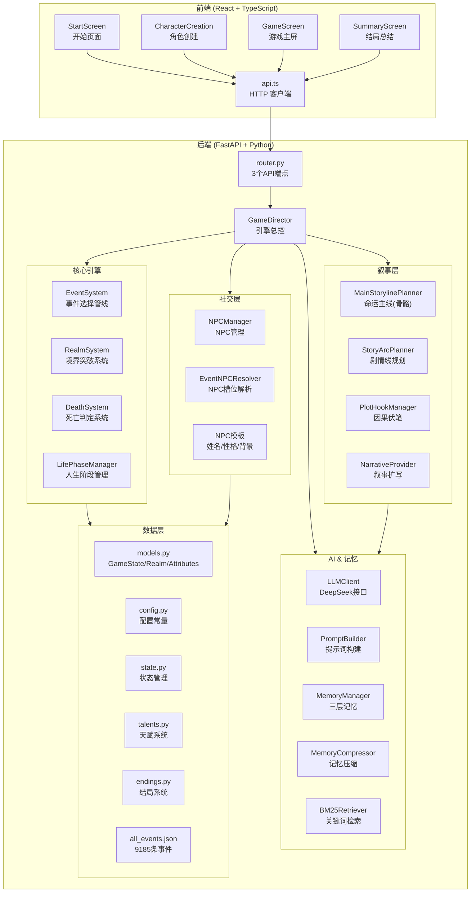
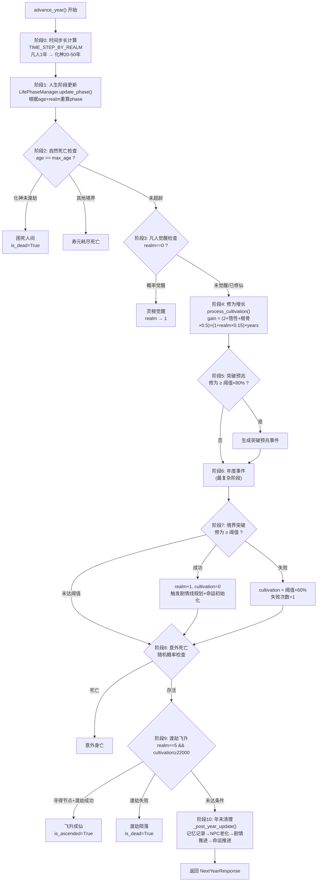
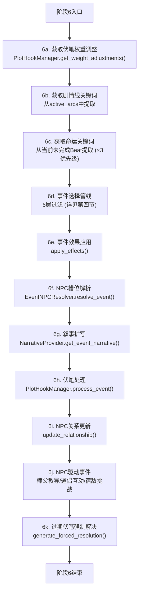
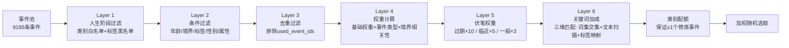
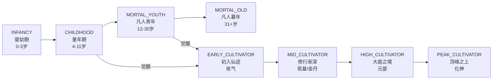
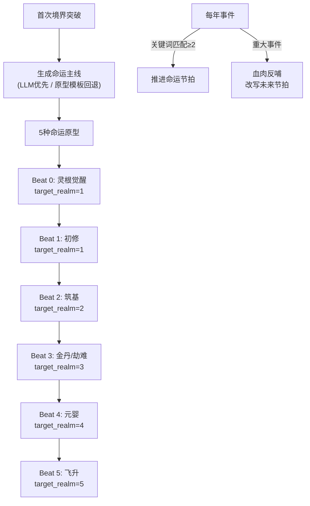
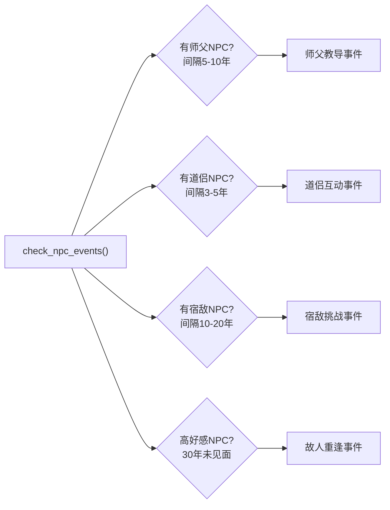
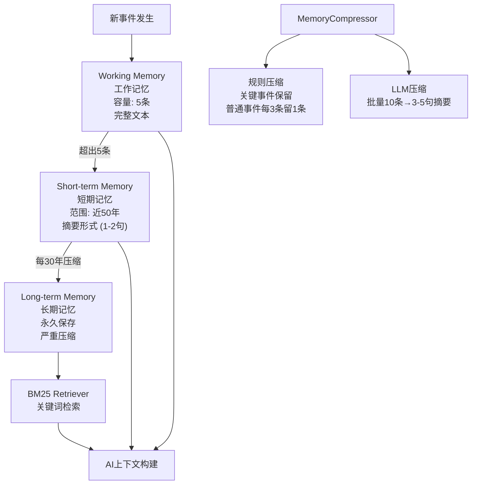
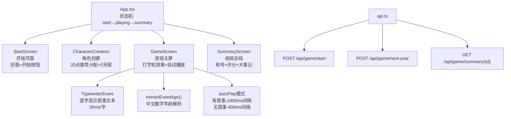

# 觅长生 — 游戏架构全景图

> 修仙人生重开模拟器 · 骨骼血肉叙事引擎

---

## 一、系统总览



---

## 二、数据模型层

### 2.1 GameState — 游戏状态全量字段

```
GameState
├── 基础标识
│   ├── game_id: str              # 8位UUID
│   ├── age: int                  # 当前年龄
│   ├── gender: str               # "male" | "female"
│   └── mortal_max_age: int       # 凡人基础寿命 (50-80随机)
│
├── 修仙属性
│   ├── realm: int                # 当前境界 (0-5 Realm枚举)
│   ├── cultivation: int          # 当前修为进度
│   ├── attributes: Attributes    # 六维属性
│   ├── talents: list[str]        # 已选天赋ID列表
│   └── tags: list[str]           # 状态标签列表
│
├── 进程控制
│   ├── events_log: list[dict]            # 完整事件历史
│   ├── used_event_ids: list[str]         # 已触发事件ID (防重复)
│   ├── is_dead: bool                     # 死亡标志
│   ├── death_reason: str                 # 死亡原因
│   ├── is_ascended: bool                 # 飞升标志
│   ├── tribulation_attempted: bool       # 是否已尝试渡劫
│   ├── space_node_found: bool            # 是否已寻得空间节点
│   ├── life_phase: int                   # 人生阶段 (0-7)
│   └── breakthrough_failures: dict       # {realm_int: 失败次数}
│
├── NPC系统
│   ├── npc_registry: dict                # {npc_id: NPC实体dict}
│   └── relationships: list[dict]         # 玩家与NPC的关系列表
│
├── 记忆系统
│   ├── memory_working: list[dict]        # 工作记忆 (最近5条)
│   ├── memory_short_term: list[dict]     # 短期记忆 (近50年)
│   ├── memory_long_term: list[dict]      # 长期记忆 (压缩)
│   └── biography_summary: str            # 压缩传记
│
├── 因果链
│   ├── plot_hooks: list[dict]            # 未解决的伏笔
│   └── resolved_hooks: list[dict]        # 已解决的伏笔
│
├── 剧情线
│   └── active_arcs: list[dict]           # 活跃剧情线
│
└── 命运主线
    └── main_storyline: dict              # 命运骨架
```

### 2.2 Realm 境界枚举

| 值 | 枚举名 | 中文 | 最大寿元 | 修为阈值 | 突破概率 | 时间步长 |
|---|--------|------|---------|---------|---------|---------|
| 0 | MORTAL | 凡人 | 50-80+寿元×3 | — | — | 1年/回合 |
| 1 | QI_REFINING | 练气 | 150年 | 400 | 15% | 1-3年/回合 |
| 2 | FOUNDATION | 筑基 | 300年 | 1000 | 14% | 3-8年/回合 |
| 3 | GOLDEN_CORE | 金丹 | 600年 | 2500 | 14% | 5-15年/回合 |
| 4 | NASCENT_SOUL | 元婴 | 1200年 | 6000 | 13% | 10-30年/回合 |
| 5 | DEITY | 化神 | 1500年 | 22000(空间节点) | — | 20-50年/回合 |

### 2.3 Attributes 六维属性

| 属性 | 字段名 | 默认值 | 随机范围 | 作用 |
|------|--------|--------|---------|------|
| 寿元 | lifespan | 3 | 2-6 | 凡人+寿元×3年；修仙者×(1+0.05×寿元) |
| 根骨 | constitution | 3 | 2-6 | 修为增益基数，渡劫成功率+0.04 |
| 悟性 | comprehension | 3 | 2-6 | 修为增益基数，觉醒概率+0.005，突破+0.008 |
| 福缘 | fortune | 3 | 2-6 | 死亡减免，fortune型事件加权，突破+0.005 |
| 魅力 | charisma | 3 | 2-6 | 社交影响 |
| 心性 | willpower | 3 | 2-6 | 渡劫成功率+0.05 |

### 2.4 GameEvent 事件数据结构

```
GameEvent
├── id: str                    # 事件唯一ID
├── text: str                  # 事件骨架文本
├── expanded_text: str         # LLM扩写后的叙事文本
├── category: str              # cultivation/social/fortune/calamity/world/violence/death/adult/common
├── event_type: str            # normal/important/danger/fortune
├── weight: int                # 基础权重 (默认50)
├── tags: list[str]            # 事件标签
├── keywords: list[str]        # 预提取关键词 (jieba分词)
├── conditions: EventCondition # 触发条件
│   ├── min_age / max_age
│   ├── min_realm / max_realm
│   ├── min_cultivation
│   ├── required_talents
│   ├── required_tags / excluded_tags
│   ├── gender
│   └── min_attribute
├── effects: EventEffect       # 事件效果
│   ├── cultivation: int
│   ├── lifespan/constitution/comprehension/fortune/charisma/willpower: int
│   ├── add_tag / add_tags / remove_tag
│   └── realm_up: bool
├── branches: list             # 事件分支 (可选)
├── creates_hook: dict         # 创建伏笔
└── resolves_hook: str         # 解决伏笔ID
```

---

## 三、GameDirector — 10阶段年度循环



### 阶段6详细子流程 — 年度事件选择与处理



---

## 四、事件选择管线 — 6层过滤



### Layer 6 三维关键词匹配详解

| 维度 | 方法 | 说明 |
|------|------|------|
| 维度1 | 关键词集交集 | `arc_keywords ∩ event._keywords` (精确匹配) |
| 维度2 | 文本子串扫描 | `arc_keyword in event.text` (广义兜底) |
| 维度3 | 标签关联映射 | `tag_map[kw] ∩ event.tags` (语义扩展) |

**权重倍率:** 匹配≥3个→×5.0，=2个→×3.5，=1个→×2.5

### Layer 4 权重计算公式

```
final_weight = base_weight
             × event_type_mod        # fortune: ×(1+福缘×0.05), danger: ×max(0.5, 1-福缘×0.02)
             × realm_relevance       # max(0.1, 1.0 - |realm - target_realm| × 0.25)
             × adult_realm_mod       # 仅adult标签: {0:0.4, 1:7.0, 2:3.2, 3:1.6, 4:0.9, 5:0.5}
```

---

## 五、境界系统

### 5.1 修为增长

```
每年修为增益 = int((2 + 悟性 + 根骨×0.5) × (1 + 境界×0.15) × 时间步长年数)
```

### 5.2 凡人觉醒概率

| 年龄段 | 基础概率 | 属性加成 |
|--------|---------|---------|
| 1-10岁 | 1% | +悟性×0.5% + 福缘×0.3% |
| 11-15岁 | 10% | 同上 |
| 16-20岁 | 20% | 同上 |
| 21-30岁 | 15% | 同上 |
| 31岁+ | 5% | 同上 |

### 5.3 境界突破

```
成功率 = min(35%, BREAKTHROUGH_BASE_CHANCE[realm] + 悟性×0.008 + 福缘×0.005)

成功: realm += 1, cultivation = 0
失败: cultivation = threshold × 60%, breakthrough_failures[realm] += 1
失败≥3次: 特殊叙事文本
```

### 5.4 渡劫飞升 (化神 realm=5)

```
空间节点发现概率 = min(6%, 1.5% + 福缘×0.3% + 悟性×0.2%)
飞升成功率 = min(92%, 30% + 心性×5% + 根骨×4% + 福缘×3% + 悟性×2%)
```

---

## 六、死亡系统

### 6.1 自然死亡 — 寿元计算

```
凡人最大寿元 = mortal_max_age + 寿元×3
修仙者最大寿元 = REALM_MAX_AGE[realm] × (1 + 寿元×0.05)
```

### 6.2 意外死亡

```
凡人分阶段:
  0-5岁: 保护 (0%)
  6-12岁: 0.2%
  13-20岁: 0.3%
  21-35岁: 0.5%
  36-50岁: 1%
  51岁+: 2% + (age-50)/20 × 1% (递增)

修仙者: 0.0005 × (age/max_age)³ × 5

福缘减免: death_chance × max(0.1, 1 - 福缘×0.03)
```

---

## 七、人生阶段系统



| 阶段 | 允许的事件类别 | 屏蔽标签 | 叙事基调 |
|------|---------------|---------|---------|
| 婴幼期 | common | mortal_life, aging, adult, sect, romance, combat... | 懵懂天真，尚在襁褓 |
| 童年期 | common, world | 同上 | 童年记忆，朦胧初现 |
| 凡人青年 | common, social, fortune, calamity, world, death | qi_refining, sect, breakthrough, practice... | 红尘烟火，凡人悲欢 |
| 凡人暮年 | common, social, world, death | 同上 + childhood, birth | 夕阳余晖，人事已非 |
| 初入仙途 | cultivation, social, fortune, calamity, world, death, common | birth, childhood, mortal_life, high_realm | 仙路初启，意气风发 |
| 修行渐深 | 同上 | 同上 | 道途渐深，历劫成长 |
| 大能之境 | 同上 | birth, childhood, mortal_life | 俯瞰天下，纵横无敌 |
| 顶峰之上 | 同上 | birth, childhood, mortal_life | 天地之巅，求索飞升 |

---

## 八、叙事系统 — 骨骼血肉架构

### 8.1 命运主线 (骨骼) — MainStorylinePlanner



**DestinyBeat 数据结构:**
```
DestinyBeat
├── description: str         # 节拍描述
├── target_realm: int        # 预期触发境界 (0-5)
├── keywords: list[str]      # 匹配关键词 (来自KEYWORD_PALETTE)
├── is_completed: bool
├── completion_age: int
├── completion_summary: str
├── is_modified: bool        # 是否被血肉反哺改写
└── original_description: str
```

**MainStoryline 数据结构:**
```
MainStoryline
├── storyline_id: str
├── archetype: str           # 天命修仙/红尘历劫/逆天改命/剑道孤峰/问道长生
├── archetype_description: str
├── destiny_beats: list[DestinyBeat]  # 6个命运节拍
├── current_beat_index: int
├── momentum: int            # 命运契合度 (0-100)
├── pivots: list[dict]       # 血肉反哺记录
├── created_at_age: int
└── is_completed: bool
```

**KEYWORD_PALETTE (关键词调色板):**
```
修行: 修炼、闭关、突破、感悟、入定、炼化、功法、心法、领悟
感悟: 顿悟、悟道、参悟、天道、道心、真谛、本源、法则
战斗: 击败、遭遇、围攻、追杀、切磋、比试、偷袭、重伤
社交: 拜师、传承、宗门、同门、弟子、道侣、师父、散修
机缘: 秘境、遗迹、宝物、丹药、灵石、法宝、灵泉、传承
劫难: 走火入魔、心魔、天劫、陨落、背叛、生死、情劫
境界: 觉醒、灵根、筑基、金丹、元婴、化神、渡劫、飞升
天地: 灵气、天地、法则、封印、禁制、阵法、神通、仙术
生物: 灵兽、妖兽、灵草、灵芝、灵丹
```

**血肉反哺触发词:** 陨落、走火入魔、大机缘、背叛、永别、决裂

### 8.2 剧情线 (血肉) — StoryArcPlanner

```
StoryArc
├── arc_id: str
├── theme: str               # "师徒情仇" / "道侣生死" / "问道之路"
├── npc_id / npc_name: str   # 关联NPC
├── phase: str               # setup → rising → climax → resolution
├── planned_beats: list[str] # 3-5个叙事节拍
├── current_beat_index: int
├── created_at_realm: int
└── is_completed: bool
```

**境界对应预设剧情线:**

| 境界 | 剧情线1 | 剧情线2 |
|------|--------|--------|
| 练气 | 初入仙途 | 师徒之谊 (绑定师父NPC) |
| 筑基 | 根基之路 | 同门情谊 (绑定同门NPC) |
| 金丹 | 问道金丹 | 宿敌恩怨 (绑定宿敌NPC) |
| 元婴 | 元婴蜕变 | 道侣之缘 (绑定道侣NPC) |
| 化神 | 天道之问 | 故人因果 (绑定最佳故人NPC) |

### 8.3 因果伏笔 — PlotHookManager

```
PlotHook
├── hook_id: str             # 如 "avenge_master"
├── description: str         # 伏笔描述
├── created_age: int
├── npc_id / npc_name: str   # 关联NPC
├── resolution_tags: list    # 可解决伏笔的事件标签
├── max_wait_years: int      # 最大等待年限 (默认100年)
├── is_resolved: bool
└── resolved_age: int
```

**权重调整策略:**
- 过期伏笔 (years_elapsed ≥ max_wait): ×10
- 临近过期 (剩余<20年): ×5
- 一般伏笔: ×3

---

## 九、NPC系统

### 9.1 NPC实体

```
NPC
├── npc_id: str
├── name: str                # 修仙风格姓名
├── gender: str
├── realm: int               # NPC境界 (±1于玩家)
├── personality: str         # 温和/冷漠/狡诈/正直/神秘/暴烈
├── role_tags: list[str]     # sword_master/alchemy_elder/sect_leader/wanderer/merchant/mysterious_elder
├── first_met_age: int
├── last_seen_age: int
├── appearance_count: int
├── is_alive: bool
├── backstory: str
└── max_age: int             # NPC寿元
```

### 9.2 Relationship 关系模型

```
Relationship
├── npc_id: str
├── relation_type: str       # 师父/同门/宿敌/道侣/挚友/泛泛之交
├── sentiment: int           # 好感度 (0-100, 50=中立)
├── last_interaction_age: int
├── interaction_count: int
├── key_memory: str          # 最重要的交互摘要
├── interactions: list       # 完整交互历史
└── unresolved_hooks: list   # 与该NPC相关的未解决伏笔
```

### 9.3 NPC驱动事件



### 9.4 NPC姓名生成

- **复姓池:** 慕容、司马、上官、欧阳、长孙、独孤、公孙、端木、轩辕、南宫、百里、东方、诸葛、令狐、宇文、尉迟
- **男名池:** 逸、玄、辰、渊、墨、无极、长青、九霄、天行、云深...
- **女名池:** 如烟、若兰、紫萱、清雪、月华、灵犀、婉清、素心...

### 9.5 性格行为模板

| 性格 | 言谈 | 行为 | 冲突 |
|------|------|------|------|
| 温和 | 语气平和，常以微笑示人 | 乐于助人 | 调和矛盾 |
| 冷漠 | 言简意赅，不喜寒暄 | 独来独往 | 冷眼旁观 |
| 狡诈 | 话中有话 | 表面热情实则盘算 | 借刀杀人 |
| 正直 | 直言不讳，嫉恶如仇 | 路见不平拔刀相助 | 堂堂正正 |
| 神秘 | 常用隐喻 | 行踪不定 | 来去无踪 |
| 暴烈 | 大嗓门，喜怒形于色 | 雷厉风行 | 先打后问 |

---

## 十、三层记忆系统



**不可遗忘事件判定:**
- event_type 为 `important` 或 `danger`
- 文本包含: 突破、飞升、觉醒、灵根、渡劫、拜师、传承、道侣、结仇、走火入魔、陨落、大机缘、生死...
- 标签包含: `npc_interaction`, `breakthrough`, `death`, `awakening`

---

## 十一、AI系统

### 11.1 LLMClient

```
模型: deepseek-v4-0324 (Flash版本)
超时: 8秒硬限制
API密钥: DEEPSEEK_API_KEY 环境变量
不可用时: 自动降级为规则文本
```

### 11.2 PromptBuilder — 5种提示词模板

| 模板 | 用途 | 输出限制 |
|------|------|---------|
| NARRATIVE_SYSTEM | 事件叙事生成 | ≤200字 |
| CONTEXTUAL_NARRATIVE_SYSTEM | 上下文感知叙事扩写 | 200-300字 |
| COMPRESSION_SYSTEM | 记忆压缩 | ≤150字 |
| NPC_INTERACTION_SYSTEM | NPC互动描写 | ≤100字 |
| MAIN_STORYLINE_SYSTEM | 命运主线生成 | ≤1000字符 JSON |

### 11.3 硬约束 (所有提示词共享)

```
- 不得描写超越当前境界的神通
- 不得自行决定死亡、突破、飞升
- 不得创造事件骨架中未提及的重大转折
- 性别一致性
- 与NPC历史交互保持一致
```

---

## 十二、前端架构



### 12.1 API端点

| 端点 | 方法 | 请求 | 响应 |
|------|------|------|------|
| `/api/game/start` | POST | 无 | game_id, age, realm, realm_name, gender |
| `/api/game/next-year` | POST | {game_id} | NextYearResponse (age, realm, events, is_dead, is_ascended...) |
| `/api/game/summary/{id}` | GET | — | LifeSummary (total_age, max_realm, death_reason, key_events, score...) |

---

## 十三、天赋系统

**4个稀有度，共37个天赋:**

| 稀有度 | 数量 | 权重 | 代表天赋 |
|--------|------|------|---------|
| Legendary (4) | 5 | ×1 | 混沌体、先天道体、仙灵根、命星护体、转世大能 |
| Epic (3) | 11 | ×2 | 火灵根、水灵根、剑骨、丹道奇才、天命之子、金刚心... |
| Rare (2) | 12 | ×3 | 灵根、天生神力、过目不忘、长寿相、命硬... |
| Common (1) | 10 | ×4 | 体健、勤奋、善良、好奇心、谨慎、勇敢... |

**选取规则:** 随机生成10个天赋供选择，保证至少1个Epic+级别天赋，玩家选3个。

---

## 十四、结局系统

### 14.1 结局类型与评分

| 结局 | 基础分 |
|------|--------|
| 飞升成仙 | 999 |
| 渡劫陨落 | 600 |
| 困死人间 | 500 |
| 凡人死亡 | 按境界称号 |

### 14.2 最终评分公式

```
总分 = 基础分 + sum(六维属性) × 2 + min(age ÷ 10, 50)
```

---

## 十五、关键词提取 (jieba分词)

```
自定义词典: 120+ 修仙领域术语 (freq=10000强制分词)
停用词表: 86个 (代词/功能词/双字虚词)
提取流程: jieba.lcut() → 过滤单字 → 过滤非汉字 → 过滤停用词 → 2字词优先 → 最多12个
事件池: 9185条事件, 平均4.9个关键词/事件
```

---

## 十六、配置常量速查

| 常量 | 值 |
|------|---|
| REALM_THRESHOLDS | {1:400, 2:1000, 3:2500, 4:6000, 5:22000} |
| BREAKTHROUGH_BASE_CHANCE | {1:0.15, 2:0.14, 3:0.14, 4:0.13} |
| SPACE_NODE_BASE_CHANCE | 0.015 (1.5%) |
| FORESHADOW_THRESHOLD | 0.80 (80%) |
| TIME_STEP_BY_REALM | {0:(1,1), 1:(1,3), 2:(3,8), 3:(5,15), 4:(10,30), 5:(20,50)} |
| REALM_MAX_AGE | {凡人:80, 练气:150, 筑基:300, 金丹:600, 元婴:1200, 化神:1500} |
| WORKING_MEMORY_SIZE | 5条 |
| SHORT_TERM_MAX_AGE | 50年 |
| COMPRESSION_INTERVAL | 30年 |
| MAX_NPCS | 20 |

---

## 十七、项目文件结构

```
a_little_game/
├── backend/
│   ├── app/
│   │   ├── engine/                    # 核心引擎
│   │   │   ├── __init__.py
│   │   │   ├── director.py            # GameDirector (10阶段循环)
│   │   │   ├── event_system.py        # 事件选择管线 (6层过滤)
│   │   │   ├── realm_system.py        # 境界突破/觉醒/渡劫
│   │   │   ├── death_system.py        # 自然死亡/意外死亡
│   │   │   ├── life_phase.py          # 8个人生阶段
│   │   │   ├── main_storyline.py      # 命运主线 (骨骼)
│   │   │   ├── story_arc.py           # 剧情线规划 (血肉)
│   │   │   ├── plot_hooks.py          # 因果伏笔系统
│   │   │   ├── narrative.py           # 叙事扩写
│   │   │   ├── event_npc_resolver.py  # NPC槽位解析
│   │   │   ├── config.py              # 配置常量
│   │   │   ├── state.py               # 状态管理
│   │   │   ├── ai/                    # AI子系统
│   │   │   │   ├── llm_client.py      # DeepSeek客户端
│   │   │   │   ├── prompt_builder.py  # 提示词构建
│   │   │   │   └── prompt_templates.py # 提示词模板
│   │   │   ├── npc/                   # NPC子系统
│   │   │   │   ├── models.py          # NPC/Relationship模型
│   │   │   │   ├── npc_manager.py     # NPC生命周期管理
│   │   │   │   └── npc_templates.py   # 姓名/性格/背景模板
│   │   │   └── memory/               # 记忆子系统
│   │   │       ├── memory_manager.py  # 三层记忆管理
│   │   │       ├── compressor.py      # 记忆压缩器
│   │   │       └── retriever.py       # BM25检索器
│   │   ├── events/                    # 事件数据
│   │   │   ├── all_events.json        # 9185条事件 (含预提取关键词)
│   │   │   └── *.json                 # 分类事件文件
│   │   ├── main.py                    # FastAPI入口
│   │   ├── router.py                  # API路由
│   │   ├── models.py                  # 数据模型
│   │   ├── talents.py                 # 天赋系统 (37个)
│   │   └── endings.py                 # 结局系统
│   ├── .env                           # 环境变量 (API密钥)
│   └── requirements.txt               # 依赖 (FastAPI, jieba, openai...)
├── frontend/
│   ├── src/
│   │   ├── pages/                     # 页面组件
│   │   │   ├── StartScreen.tsx        # 开始页
│   │   │   ├── CharacterCreation.tsx  # 角色创建
│   │   │   ├── GameScreen.tsx         # 游戏主屏
│   │   │   └── SummaryScreen.tsx      # 结局总结
│   │   ├── utils/
│   │   │   ├── api.ts                 # HTTP客户端
│   │   │   └── types.ts              # TypeScript类型
│   │   ├── App.tsx                    # 主应用组件
│   │   ├── App.css / index.css        # 样式
│   │   └── main.tsx                   # 入口
│   └── package.json
├── Dockerfile.backend / Dockerfile.frontend
└── docker-compose.yml
```

---

## 十八、技术栈

| 层 | 技术 | 版本 |
|----|------|------|
| 后端框架 | FastAPI | — |
| 数据验证 | Pydantic | — |
| 中文分词 | jieba | ≥0.42 |
| LLM接口 | OpenAI SDK (DeepSeek) | — |
| 前端框架 | React + TypeScript | — |
| 构建工具 | Vite | — |
| 样式 | Tailwind CSS | — |
| 容器化 | Docker + docker-compose | — |

---

> 代码行数统计: Python 11,581行 / TypeScript 1,251行 / CSS 599行 / HTML 19行 = **13,472行代码**
> 数据行数: all_events.json 243,870行 + 其他JSON 66,043行 = **309,913行数据**
